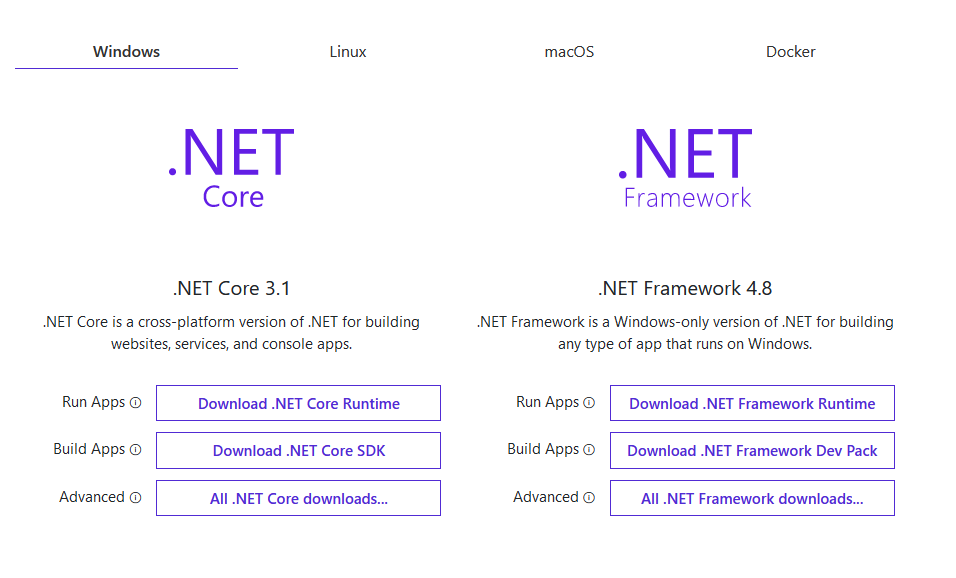
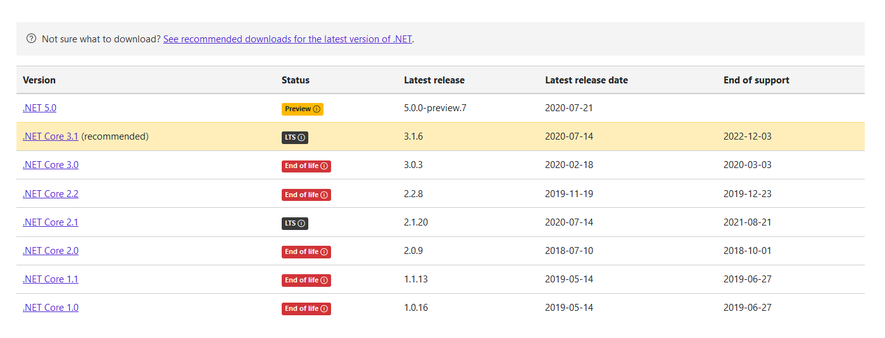
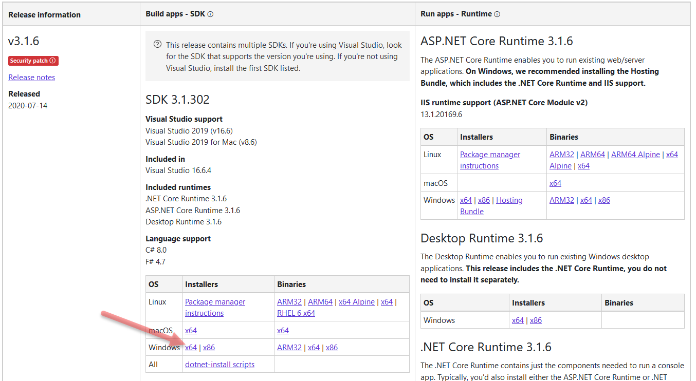
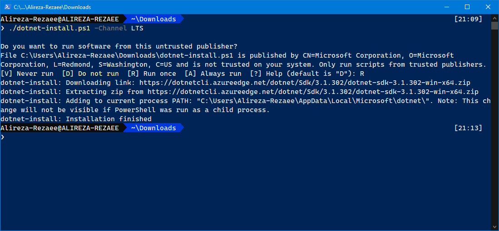

# آموزش دریافت بسته Net.

## مقدمه

<!-- .Net is correct (Net. isn't correct) -->

Net. یک بستر توسعه نرم افزاری[۱](#f1) رایگان، متن‌باز[۲](#f2) و چندسکویی[۳](#f3) برای ساخت انواع گوناگون نرم افزار است.  
با Net. از فرصت برنامه نویسی با چند زبان، ویرایشگر و کتابخانه برای برنامه نویسی  وب، تلفن همراه، میزکار[۴](#f4)، بازی و اینترنت اشیا[۵](#f5) بهره‌مند می شوید.

________________   
<b id="f1">1</b> Developer platform [↩](#a1)  
<b id="f2">2</b> Open-source [↩](#a2)  
<b id="f3">3</b> Cross-platform [↩](#a3)  
<b id="f4">4</b> Desktop [↩](#a4)  
<b id="f5">5</b> Internet of things (IoT) [↩](#a5)  

## انتخاب Net.

برای دریافت Net. به سایت رسمی (به نشانی [dot.net](https://dotnet.microsoft.com)) مراجعه می کنیم. با این صفحه مواجه می‌شویم:

ممکن است از سیستم عامل های مختلفی وارد این سایت شوید؛ dotnet به صورت خودکار سعی می‌کند نسخه متناسب سیستم عامل جاری (در مثال بالا Windows) را پیشنهاد دهد.

دو ستون در سمت راست و چپ، یکی به Net Framework. و دیگری به Net Core. اشاره میکند.
Net Core. از نسخه 3.1 به بعد با نام Net Framework. ادغام می‌شود و از نسخه 5 به بعد با نام واحد Net. شناخته می شوند.
از همین رو در این نوشتار به تفاوت Net Framework. و Net Core. نخواهیم پرداخت.

برای دریافت Net. از ستون Net Core. گزینه [All .NET Core downloads](https://dotnet.microsoft.com/download/dotnet-core) را انتخاب میکنیم.

این جدول حاوی نسخه های Net Core. (شامل پیش نمایش Net 5.)
دارای پنج ستون زیر است:

* ستون Version: شماره نسخه بسته
* ستون Status: نمایشگر وضعیت بسته که یکی از برچسب های پیش نمایش (Preview)، پایان عمر (End Of Life) یا پشتیبانی بلند مدت (Long Term Support) را نشان می دهد.
* ستون Latest release: شماره جزئی آخرین انتشار بسته
* ستون Latest release date: تاریخ میلادی انتشار آخرین انتشار بسته
* ستون End of support: تاریخ پایان پشتیبانی بسته

 بسته پیشنهادی (Net Core 3.1.) را انتخاب میکنیم. وارد [صفحه دریافت](https://dotnet.microsoft.com/download/dotnet-core/3.1) می‌شویم. این صفحه دارای جدولی بزرگ با سه ستون است:

* ستون Release information: نسخه جزئی بسته (هر چه بالاتر باشد بهتر است. نسخه های قدیمی شامل مشکلات و ضعف امنیتی هستند.)
* ستون Build apps - SDK: شامل بسته های مورد نیاز جهت ساخت و توسعه نرم افزار (Run apps - Runtime را به همراه خود دارد)
* ستون Run apps - Runtime: شامل بسته های مورد نیاز صرفاً جهت اجرای نرم افزار

## دریافت

### دریافت به صورت دستی

اینک با توجه به مشخصات سیستم عامل، نسخه مطلوب را با کلیک روی بسته انتخاب کنید.

> **توجه**: اگر نسخه SDK را برای نرم افزار [Visual Studio](https://visualstudio.microsoft.com/) دریافت میکنید حتماً به پیش‌نیاز های ذکر شده دقت کنید. ممکن است نسخه SDK با نسخه Visual Studio منطبق نباشد، آنگاه قادر به استفاده از این بسته در محیط ویژوال استدیو نخواهید بود.

تصویر زیر به عنوان نمونه است و لزوماً نباید مانند تصویر زیر عمل کنید.

### دریافت با خط فرمان

این روش نیازمند آشنایی با دستورات خط فرمان (Bash یا PowerShell) و [اسکرپت دریافت Net.](https://docs.microsoft.com/dotnet/core/tools/dotnet-install-script) است.

به منظور دریافت اسکرپت [dotnet-install scripts](https://dotnet.microsoft.com/download/dotnet-core/scripts) را انتخاب کنید.
اکنون با توجه به [مستندات](https://docs.microsoft.com/dotnet/core/tools/dotnet-install-script) نسخه مورد نظر خود را دریافت کنید.

تصویر زیر به عنوان نمونه است و لزوماً نباید مانند تصویر زیر عمل کنید.

