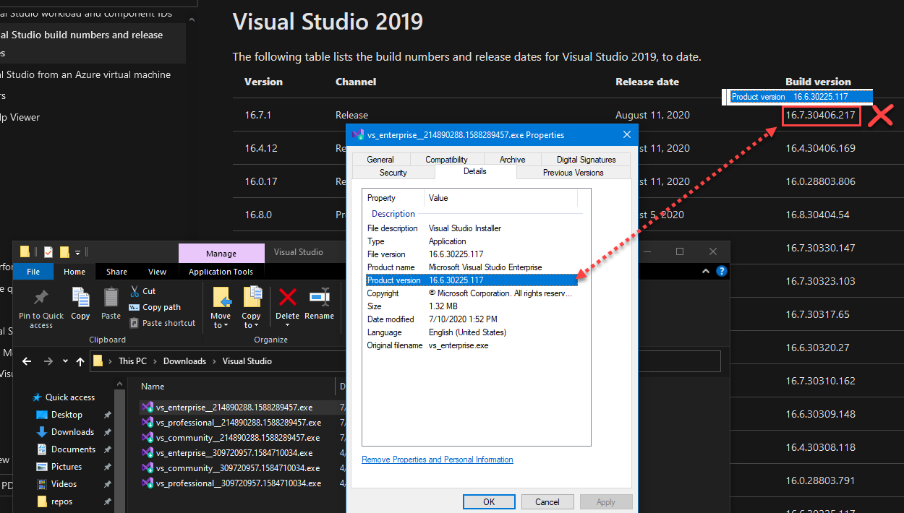
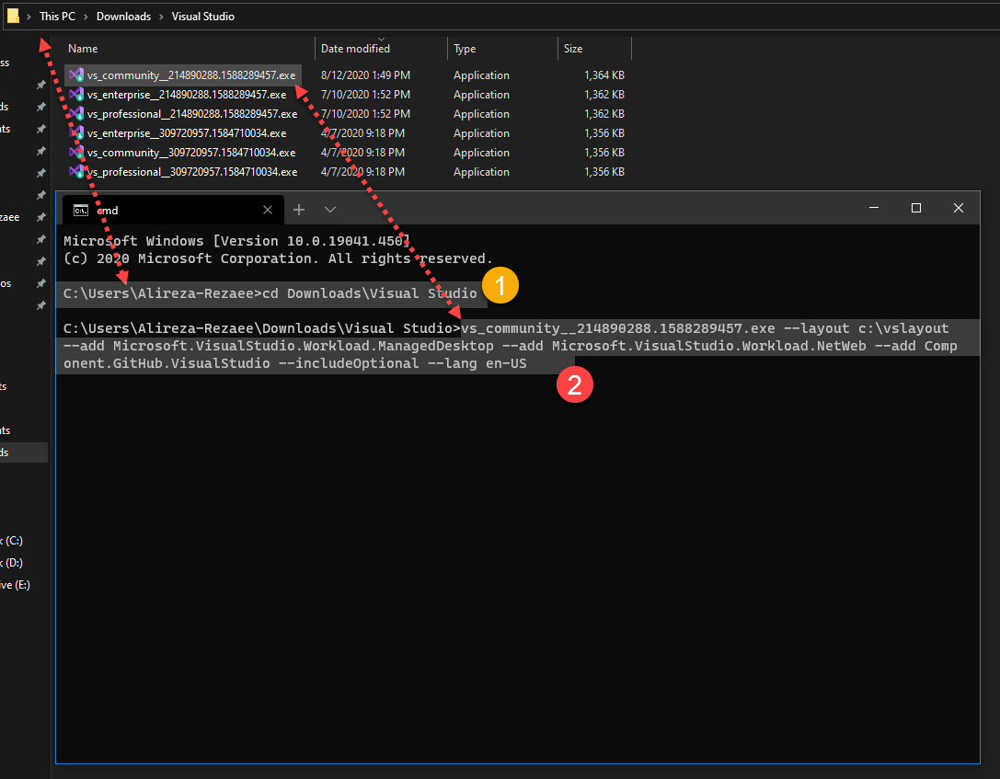
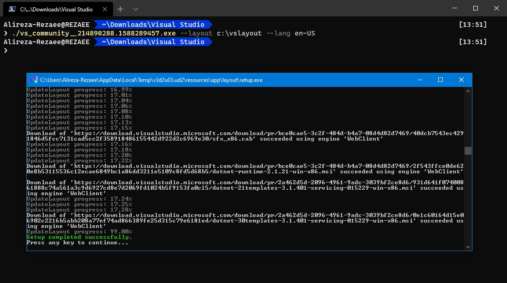
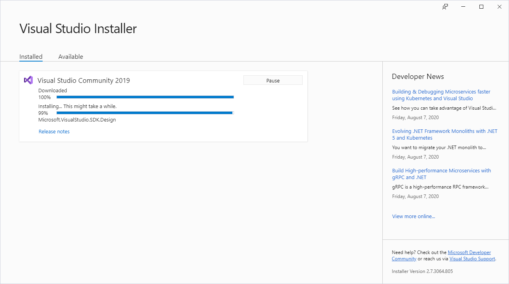
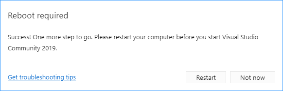
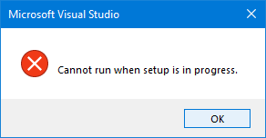

<div dir="rtl">

# آموزش نصب و به‌روز رسانی آفلاین Visual Studio


Visual Studio به همراه Visual Studio Code  محیط یکپارچه توسعه نرم افزار از سوی شرکت Microsoft است. از این نرم افزار برای ساخت برنامه هایی از قبیل وب، خدمات وب، موبایل و دسکتاپ استفاده می شود.

<hr/>

## آموزش نصب

در این آموزش فایل نصب آفلاین را تهیه و در ادامه از این طریق Visual Studio را نصب یا به روز رسانی می‌کنیم. این روش برای کاهش مصرف پهنای باند اینترنت کارایی دارد. در خانه، محل کار، دانشگاه یا کافی نت ممکن است چندین دستگاه داشته باشید که همگی آنها باید مجهز به Visual Studio باشند. اگر به ازای هر سیستم فایل نصب را دریافت کنیم، در مجموع پهنای باند و زمان زیادی از دست خواهیم داد. به همین منظور تنها یکبار فایل نصب آفلاین را تهیه و بعداً برای دیگر سیستم ها بدون دوباره کاری تنها فرایند نصب (گام سوم) را طی می‌کنیم. ما در این روش اصطلاحاً local install cache را تهیه می‌کنیم. در این فرایند به خط فرمان نیاز ویژه‌ای داریم.


### گام اول: نصب خود راه‌انداز Visual Studio


از فهرست زیر بر اساس ویرایش Visual Studio فایل(-های) مورد نیازتان را دریافت کنید. فایل نهایی نصب-که در پایان ساخته می شود- حاصل همین انتخاب خواهد بود. امکان دریافت همزمان چند ویرایش وجود دارد.

<div dir="ltr">

| ویرایش | فایل |
|--|--|
| Visual Studio Community | [vs_community.exe](https://visualstudio.microsoft.com/thank-you-downloading-visual-studio/?sku=community&rel=16&utm_medium=microsoft&utm_source=docs.microsoft.com&utm_campaign=offline+install&utm_content=download+vs2019) |
| Visual Studio Professional | [vs_professional.exe](https://visualstudio.microsoft.com/thank-you-downloading-visual-studio/?sku=professional&rel=16&utm_medium=microsoft&utm_source=docs.microsoft.com&utm_campaign=offline+install&utm_content=download+vs2019) |
| Visual Studio Enterprise | [vs_enterprise.exe](https://visualstudio.microsoft.com/thank-you-downloading-visual-studio/?sku=enterprise&rel=16&utm_medium=microsoft&utm_source=docs.microsoft.com&utm_campaign=offline+install&utm_content=download+vs2019) |
| Visual Studio Build Tools | [vs_buildtools.exe](https://visualstudio.microsoft.com/thank-you-downloading-visual-studio/?sku=buildtools&rel=16&utm_medium=microsoft&utm_source=docs.microsoft.com&utm_campaign=offline+install&utm_content=download+vs2019) |

</div>

> **توجه**:
برای نسخه Community حداکثر ۳۰ روز فرصت دارید تا ویژوال استدیو را به حساب کاربری متصل کنید. از آن پس بدون هزینه و محدودیت زمانی قادر به استفاده از نسخه Community خواهید بود.

> **توجه**:
در صورتی که پیش از این، فایل خود راه‌انداز (bootstrapper) را دریافت کرده اید برای ارزیابی و تایید نسخه در سیستم عامل Windows، روی فایل خود راه‌اندار کلیک راست و مشخصات (Properties) را انتخاب کنید. سپس از سربرگ Details (جزئیات) قسمت نسخه محصول (Product version) را ملاحظه کنید. برای انطباق با [برگه آخرین شماره و تاریخ بیلد Visual Studio انتشار](https://docs.microsoft.com/en-us/visualstudio/install/visual-studio-build-numbers-and-release-dates?view=vs-2019) مقایسه کنید. در صورت مطابقت نیازی به دریافت مجدد خود راه‌انداز نیست.




### گام دوم: تهیه local install cache

>**توجه**: اگر پیش از این از طریق محیط گرافیکی (بدون پارامتر خط فرمان) و انتخاب گزینه Download all, Then install اقدام به نصب کرده اید؛ آن راهکار برای تهیه local install cache طراحی نشده است. پس مجدداً برای تهیه local cache از ابتدا مطابق گام ها عمل کنید.

>**توجه**:
در این گام برای دریافت فایل های نصب ویژوال استدیو به اینترنت نیاز داریم. برای دریافت اولیه ممکن است تا ۳۰ گیگ پهنای باند مصرف شود. البته اگر Workload ها و component های کمتری انتخاب کنید این میزان بسیار کمتر خواهد شد.


اینک خط فرمان (ترجیحاً Command Prompt) را در محل bootstrapper (خود راه‌انداز) 
اجرا کنید. سپس مانند زیر فرمان اجرای نرم افزار bootstrapper را صادر کنید.


توضیح تصویر:
مسیر خط فرمان را در محل bootstrapper قرار می‌دهیم (۱). نرم افزار bootstrapper را از طریق **خط فرمان** با پارامتر های مدنظرمان (نه الزاماً مانند تصویر بالا) اجرا می‌کنیم. (۲)

>**توجه**:
مراقب طول مسیر محل layout باشید. برای پیشگیری از وقوع خطا از طول مسیر (کمتر از ۸۰ کاراکتر) اطمینان حاصل کنید. (مانند: c:\vslayout)

پس از اجرای دستور، فرایند ساخت layout در مسیر انتخاب شده آغاز می‌شود. زمان تکمیل دانلود وابسته به پهنای باند شما خواهد بود.


**مثال های متنوع از نحوه اجرای bootstrapper**:

* برای **توسعه برنامه های وب و دسکتاپ** Net.
<pre dir="ltr"><code>
vs_community.exe --layout c:\vslayout --add Microsoft.VisualStudio.Workload.ManagedDesktop --add Microsoft.VisualStudio.Workload.NetWeb --add Component.GitHub.VisualStudio --includeOptional --lang en-US
</code></pre>

* برای **توسعه برنامه های دسکتاپ و آفیس** Net.
<pre dir="ltr"><code>
vs_community.exe --layout c:\vslayout --add Microsoft.VisualStudio.Workload.ManagedDesktop --add Microsoft.VisualStudio.Workload.Office --includeOptional --lang en-US
</code dir="ltr"></pre>

* برای **توسعه برنامه ها با ++C**
<pre dir="ltr"><code>
vs_community.exe --layout c:\vslayout --add Microsoft.VisualStudio.Workload.NativeDesktop --includeRecommended --lang en-US
</code></pre>

* برای **دریافت کامل، همراه تمام قابلیت ها** (طول می‌کشد)
<pre dir="ltr"><code>
vs_community.exe --layout c:\vslayout --lang en-US
</code></pre>



>**توجه**:
دریافت کامل layout ویژوال استدیو علاوه بر زمان حجم زیادی (حداقل ۳۵ گیگ فضا) می‌طلبد. برای کسب اطلاعات بیشتر [نیازمندی های Visual Studio](https://docs.microsoft.com/en-us/visualstudio/releases/2019/system-requirements/) مطالعه کنید.

اگر مایل به استفاده از زبان دیگری برای ویژوال استدیو باشید، می‌توانید عبارت ```en-US``` را به سایر [زبان های پشتیبانی شده](https://docs.microsoft.com/en-us/visualstudio/install/create-an-offline-installation-of-visual-studio?view=vs-2019#list-of-language-locales) تغییر دهید.

برای انتخاب سفارشی workload ها و component ها، از [فهرست](https://docs.microsoft.com/en-us/visualstudio/install/workload-and-component-ids?view=vs-2019) شناسه آن ها را بدست می‌آورید.


### گام سوم: نصب ویژوال استدیو از local cache

>**توجه**:
زمانی که برای نصب از طریق local install cache اقدام می‌کنید، برنامه نصب از نسخه محلی هر یک از فایل ها استفاده می‌کند. امّا اگر هنگام نصب، درخواست نصب component جدیدی را -که در cache موجود نباشد- داشته باشید، آنگاه برای دریافت از اینترنت تلاش می‌کند.

برای کسب اطمینان از اینکه تنها بسته های دریافت شده را نصب می‌کنید از پارامتر های مشابه دستور قبلی استفاده کنید.

به عنوان نمونه اگر در گام قبل دستوری مانند زیر به کار بردید:
<pre dir="ltr"><code>
vs_community.exe --layout c:\vslayout --add Microsoft.VisualStudio.Workload.ManagedDesktop --add Microsoft.VisualStudio.Workload.NetWeb --add Component.GitHub.VisualStudio --includeOptional --lang en-US
</code></pre>

آنگاه مانند زیر عمل کنید:
<pre dir="ltr"><code>
c:\vslayout\vs_community.exe --noweb --add Microsoft.VisualStudio.Workload.ManagedDesktop --add Microsoft.VisualStudio.Workload.NetWeb --add Component.GitHub.VisualStudio --includeOptional
</code></pre>



پس از نصب ممکن است به reboot نیاز داشته باشید.


<hr/>

## آموزش به روز رسانی


### گام اول: دریافت یا به روز رسانی local cache
اگر پیش از این local cache را تهیه نکرده اید یا قصد به روز رسانی local cache را دارید، ابتدا گام های اول و دوم را از بالا طی کنید.


### گام دوم: به روز رسانی ویژوال استدیو
برای به روز رسانی مانند گام سوم فرایند نصب عمل می‌کنیم، امّا نکات زیر را به خاطر می‌سپاریم:

۱. برای به روز رسانی از یک دستور به نام ```update``` استفاده می‌کنیم. به صورت پیش‌فرض (بدون update) در حالت نصب (install) قرار دارد؛ پس به کارگیری ```update``` را فراموش نکنید.

۲. از پارامتر ```noWeb``` استفاده می‌کنیم تا از دریافت بسته ها از اینترنت در حین نصب پیش‌گیری کنیم.

۳. باید اسامی workload ها و component هایی که در نسخه جاری نصب شده اند را بدانیم.

مثال:
<pre dir="ltr"><code>
c:\vslayout\vs_community.exe update --noweb --add Microsoft.VisualStudio.Workload.ManagedDesktop --add Microsoft.VisualStudio.Workload.NetWeb --add Component.GitHub.VisualStudio --includeOptional
</code></pre>


>اگر حین نصب، Visual Studio را باز کنید، با **هشداری** مواجه می‌شوید که از اجرای ویژوال استدیو پیش‌گیری می‌کند.




<hr/>

**تحت تحریم**:

متاسفانه Visual Studio یکی از نرم افزار هایی است که برنامه نویسان ایرانی از مسیر قانونی قادر به استفاده آن نمی‌باشند. از طرفی ویرایش های Professional و Enterprise فروشی اند که بر اساس قوانین Microsoft، جمهوری اسلامی ایران تحت تحریم است. همچنین در خصوص ویرایش رایگان Community به این علت که صرفاً برای دو سیستم عامل Windows و MacOS منتشر می‌شود که هر دو سیستم عامل بر اساس قوانین شرکت های متبوع برای ایرانیان تحریم اند، این ویرایش رایگان نیز به صورت غیر مستقیم امکان استفاده قانونی را از برنامه نویسان ایرانی سلب کرده است.
برای اطلاعات بیشتر [فهرست نرم افزارهای تحریمی](https://github.com/alireza-rezaee/sanctions-against-Iran) را بررسی کنید.

</div>